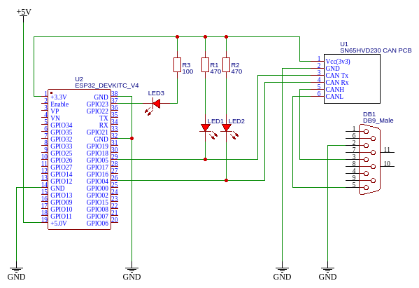

= CAN Keyboard

A small project to control a Spotify playlist on a smartphone using buttons on the car's steering wheel.

== Overview

In my setup, music in the car is played directly from the smartphone via bluetooth.
This implies that switching music must be done manually on the phone.
The main goal of the project is to create a device that simulates a bluetooth keyboard that detects on CANBUS signals of pressed keys on the steering wheel.

Something like that:

== Firmware

The firmware was created with PlatformIO.
The most challenging part was to debug CANBUS to find the frames responsible for the keys pressed on the steering wheel.

// TODO more details here

== Electrical design

Used components:

- ESP32 devkit (38 pins)
- MCP2551 CAN Transceiver (a chip with 3.3V logic, such as SN65HVD233, would be better)

